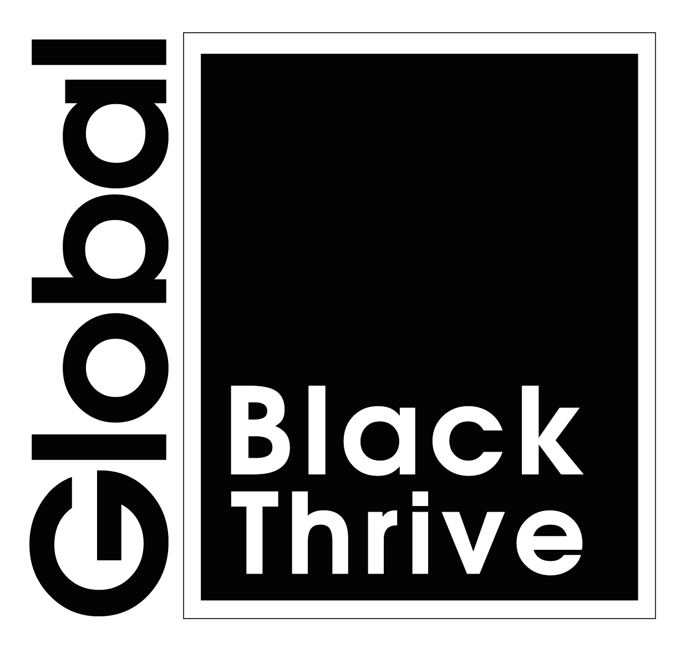

<!-- PROJECT LOGO -->
 

    
  </a>
  

  
# Black Thrive Shared Measurement System for Haringey
 
## Overview

This Rproject contains the scripts and data necessary to produce the methods, procedure, and results for Black Thrive's Shared Measurement System analysis for Haringey. 

The aim of this analysis is to quantify racial inequality in Haringey by comparing various indicators for the Black population with the White population. Doing so makes it possible to identify the aspects of life in Haringey where inequality is manifest and to highlight where change is needed.

## Requirements

### Programs

RStudio is required to open and run the analysis. This project was produced using 

- RStudio 2021.09.0 Build 351 "Ghost Orchid"
- R version 4.1.1

### Packages required

The script uses the following R packages. These need to be installed using <b>install.packages("</b>package name<b>")</b> if they are not already installed on your system.

- gmodels
- tidyverse
- ggrepel
- kableExtra
- epitools
- scales
- showtext

## Contents

**haringey_sms.Rproj**: Project file.

### Data

**data/haringey_stop_search_2020_2021_v2.csv**: Stop and Search data for Haringey

**data/haringey_children_looked_after_2018_2019_v3.csv**: Data for Children Looked After indicator

**data/haringey_employment_rate_2020_2021_v3.csv**: Employment rate data

**data/haringey_4_plus_gcse_english_maths_2019_2020_v2.csv**: Data for number of pupils achieving at least Level 4 in GCSE English and Maths

**data/haringey_good_development_2018_2019_v2.csv**: Data for number of children reaching a Good Level of Development at age 5

**data/haringey_stat_homeless_2020_2021_v2.csv**: Data for number of households statutorily homeless or at risk of becoming homeless

### Scripts

**scripts/haringey_sms_analysis.Rmd**: Script for processing and analysing data

**scripts/haringey_sms_analysis.html**: Knitted html markdown file generated by above script

**style.css**: Styles file for fonts

### Other

**images/btg_logo.png**: Black Thrive logo

## Setup

Once downloaded, unzip to a destination of your choice. Note that the Stop and Search data also needs to be unzipped, with the resulting csv file being located in the ***data*** directory. Be sure to retain the original folder structure.

Use **haringey_sms.Rproj** to open project. 

To load the analysis script, use *File > Open File*, navigate to the ***scripts*** folder, and select **haringey_sms_analysis.Rmd**. To run the script, select *Run > Run all* (Ctrl + Alt + R [Windows]; Cmd + Option + R[Mac]).

If you just want to view the knitted html document, using your system file navigator navigate to the scripts folder and open **haringey_sms_analysis.html** in your preferred browser.

## Contact

If you have any questions, comments, or feedback please contact the Research Team at Black Thrive: research@blackthrive.org, FAO Jolyon Miles-Wilson.
